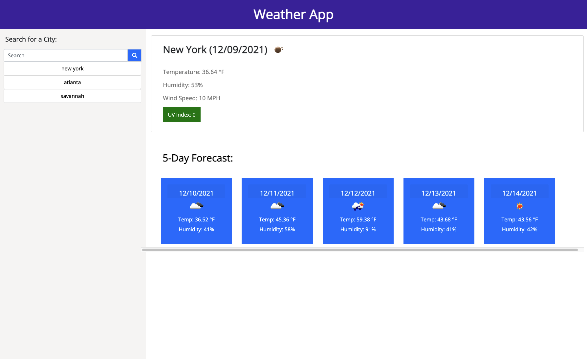

# WeatherApp
A weather dashboard providing current and future forecasts for cities around the world. 

HOW IT WORKS:
In this application the user can view current and future weather conditions. The user is given a search bar where they enter in the city of their choice. Once they click on the search button, a five day forecast will appear. When they refresh the page, their search history will remain and they are able to click on those past searches and view the five day forecast for those cities. 

GitHub repository for my Password Generator: https://github.com/SarahLabrotLientz/WeatherApp

URL to live website: https://sarahlabrotlientz.github.io/WeatherApp/

Coding languages: HTML, CSS, JavaScript